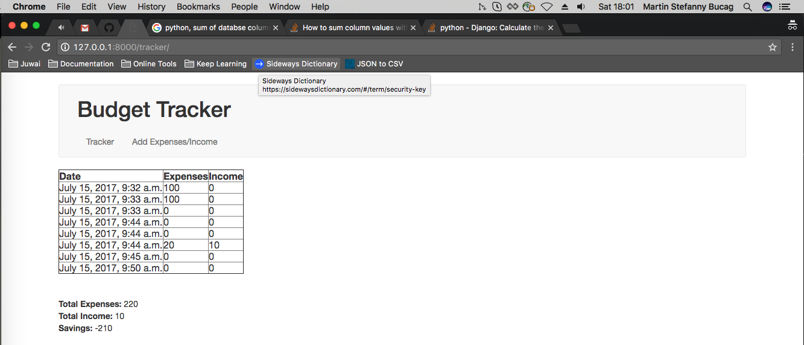

## Budget Tracker 

Write an application that keeps track of a household’s budget. The user can add expenses, income, and recurring costs to find out how much they are saving or losing over a period of time. 

_Optional: Allow the user to specify a date range and see the net flow of money in and out of the house budget for that time period._

Screenshot
==================

Improvements
==================
- User Interface
- Form validation not to allow income = 0 and expenses =0
