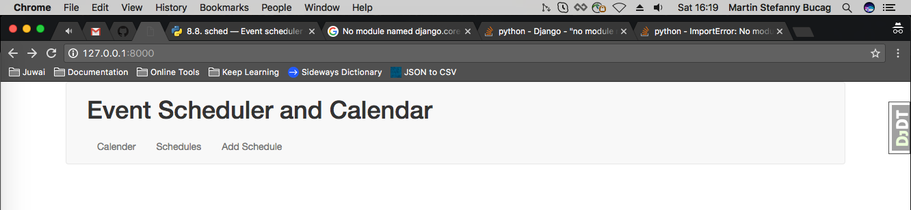
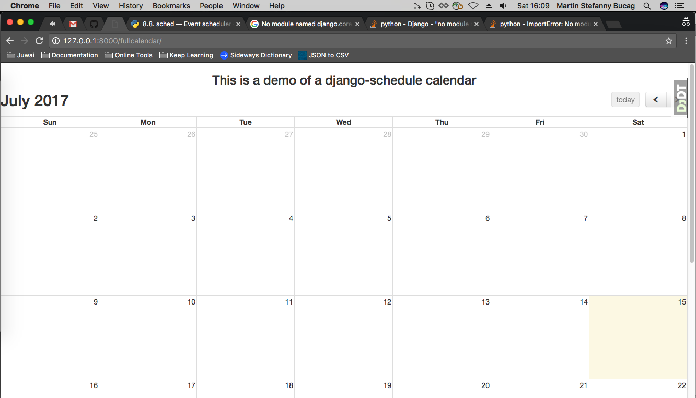
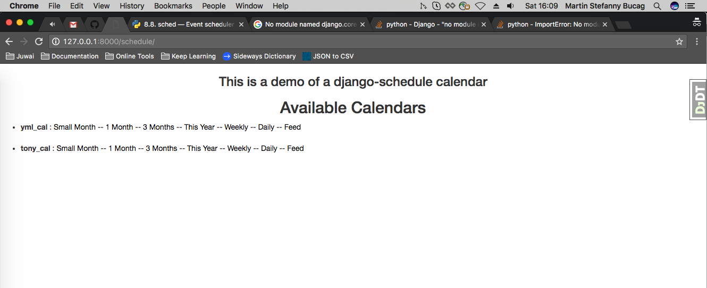

## Event Scheduler and Calendar

An application which allows the user to enter a date and time of an event, eventnotes and then schedule those events on a calendar. The user can then browse the calendar or search the calendar for specific events. 

Allow the application to create re-occurrence events that reoccur every day, week, month, year etc.

_This is a project using django-scheduler and django-scheduler-views_

## Installation
1. Install virtualenv
2. Install `requirements.txt`

## Usage
```
python manage.py bower install
python manage.py migrate
python manage.py runserver
```

Screenshots
=======================
* Main Page


* Calender



* Set Schedules
